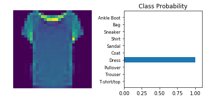
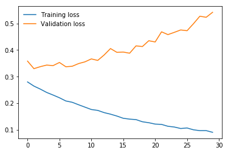

```python
import torch
from torchvision import datasets, transforms
import torch.nn.functional as F

# define a transform to normalize the data
transform = transforms.Compose([
    transforms.ToTensor(),
    transforms.Normalize([0.5], [0.5])
])

# Download and load training data
trainset = datasets.FashionMNIST(
    'data/FASHION_MNIST_data/', download=True, train=True, transform=transform)
trainloader = torch.utils.data.DataLoader(trainset, batch_size=64, shuffle=True)

# Download and load test data
testset = datasets.FashionMNIST(
    'data/FASHION_MNIST_data', download=True, train=False, transform=transform)
testloader = torch.utils.data.DataLoader(testset, batch_size=64, shuffle=True)


```


```python
# Create the network, define criterion and optimizer
from torch import nn, optim

input_units = 784
hidden_units = [256, 128, 64]
output_units = 10

model = nn.Sequential(
    nn.Linear(input_units, hidden_units[0]),
    nn.ReLU(),
    nn.Linear(hidden_units[0], hidden_units[1]),
    nn.ReLU(),
    nn.Linear(hidden_units[1], hidden_units[2]),
    nn.ReLU(),
    nn.Linear(hidden_units[2], output_units),
    nn.LogSoftmax(dim=1)
)

optimizer = optim.Adam(model.parameters(), lr=0.001)
criterion = nn.NLLLoss()
epochs= 5
```


```python
# Train the network
for i in range(epochs):
    running_loss = 0
    for images, target_labels in trainloader:
        # flatten images into 784 long vector for the input layer
        images = images.view(images.shape[0], -1)
        # clear gradients because they accumulate
        optimizer.zero_grad()
        out = model(images)
        loss = criterion(out, target_labels)
        # let optmizer update the parameters
        loss.backward()
        optimizer.step()
        
        running_loss += loss.item()
    else:
        print(f'Training loss: {running_loss/len(trainloader)}')
```

    Training loss: 0.5213481309666816
    Training loss: 0.3745512448664286
    Training loss: 0.33560746372032013
    Training loss: 0.3119227885723368
    Training loss: 0.29549156429607476


```python
import matplotlib.pyplot as plt
import numpy as np

def view_classification(img, probabilities):
    """Utility to imshow the image and its predicted classes."""
    ps = probabilities.data.numpy().squeeze()
    
    fig, (ax1, ax2) = plt.subplots(figsize=(6,9), ncols=2)
    ax1.imshow(img.resize_(1, 28, 28).numpy().squeeze())
    ax1.axis('off')
    ax2.barh(np.arange(10), ps)
    ax2.set_aspect(0.1)
    ax2.set_yticks(np.arange(10))
    ax2.set_yticklabels([
        'T-shirt/top',
        'Trouser',
        'Pullover',
        'Dress',
        'Coat',
        'Sandal',
        'Shirt',
        'Sneaker',
        'Bag',
        'Ankle Boot'
    ], size='small');
    ax2.set_title('Class Probability')
    ax2.set_xlim(0, 1.1)
    
    plt.tight_layout()          
```


```python
# Test out the network
dataiter = iter(testloader)
images, labels = dataiter.next()
img = images[1]
# reshape images to the model input layer's liking.
test_images = images.view(images.shape[0], -1)
# Calculate class probabilities (softmax)
ps = torch.exp(model(test_images))
print(ps.shape)

# plot out the image and probability distribution
view_classification(img, ps[0])
```

    torch.Size([64, 10])





#### Validation
To test for overfitting, we measure the performance of the model on data that isn't part of the training set.
We'll use accuracy, the percentage of classes the NN predicted correctly.
Other options are `precision and recall and top-5 error rate`.

First, we do one forward pass with one batch from the test set


```python
images, labels = next(iter(testloader))
# get class probabilities (10 class probabilities for 64 examples)
images = images.view(images.shape[0], -1)
ps = torch.exp(model(images))
ps.shape
```


    torch.Size([64, 10])


With the probabilities, we can use `ps.topk` to get the most likely class and return the `k` highest values. Since we just want the most likely class, we can use `ps.topk(1)`. This returns a tuple of top-k values and top-k indices. If the highest values is the 5th element, we'll get back 4 as the index.


```python
top_p, top_class = ps.topk(1, dim=1)
print(top_class.shape)
print (labels.shape)

```

    torch.Size([64, 1])
    torch.Size([64])


```python
# check where our predicted classes match with true classes from labels
equals = top_class == labels.view(*top_class.shape) # make sure they have the same shape
# convert the equals byte tensor into float tensor before doing the mean
accuracy = torch.mean(equals.type(torch.FloatTensor)) 
print(f'Accuracy: {accuracy.item()*100}%')
```

    Accuracy: 89.0625%


```python
# Train the network
epochs = 30
steps = 0

train_losses, test_losses = [], []
for i in range(epochs):
    running_loss = 0
    for images, target_labels in trainloader:
        # flatten images into 784 long vector for the input layer
        images = images.view(images.shape[0], -1)
        # clear gradients because they accumulate
        optimizer.zero_grad()
        out = model(images)
        loss = criterion(out, target_labels)
        # let optmizer update the parameters
        loss.backward()
        optimizer.step()
        
        running_loss += loss.item()
    else:
        accuracy = 0
        test_loss = 0
        
        # turn off gradients for validation, saves memory and computation
        with torch.no_grad():
            for images, labels in testloader:
                images = images.view(images.shape[0], -1)
                log_ps = model(images)
                test_loss += criterion(log_ps, labels)
                
                ps = torch.exp(log_ps)
                _, top_class = ps.topk(1, dim=1)
                equals = top_class == labels.view(*top_class.shape)
                accuracy += torch.mean(equals.type(torch.FloatTensor))
        
        train_losses.append(running_loss/len(trainloader))
        test_losses.append(test_loss/len(testloader))
        
        print(f'Accuracy: {accuracy/len(testloader)}')
        print(f'Training loss: {running_loss/len(trainloader)}')
        print(f'Test loss: {test_loss/len(testloader)}')  
```


```python
plt.plot(train_losses, label='Training loss')
plt.plot(test_losses, label='Validation loss')
plt.legend(frameon=False)
```


    <matplotlib.legend.Legend at 0x11f375390>





As the network gets better and better on the training data, it's actually starting to get worse on the test/validation data.
This is because as it's learning, it's failing to generalize to data outside of that.
This is the overfitting phenomenon at work.

We should always strive to get the lowest validation loss possible. 
* Early stopping – use version of the model with the lowest validation loss (8-10 training epochs)
* Dropout – give a drop probability, randomly drop input units, forcing the network to share imformation between weights, increasing it's ability to generalize to new data.


## Network with Dropout
During training we want to prevent overfitting using dropout. But during inference, we want to use all of our units. So we turn off the dropout using `mode.eval()`: which sets the model to evaluation mode. After calculating the validation loss and metric, we set the model back to train mode using `model.train()`


```python
from torch import nn

class Classifier(nn.Module):
    def __init__(self):
        super().__init__()
        self.fc1 = nn.Linear(784, 256)
        self.fc2 = nn.Linear(256, 128)
        self.fc3 = nn.Linear(128, 64)
        self.fc4 = nn.Linear(64, 10)
        
        # Dropout module with 0.2 drop probability
        self.dropout = nn.Dropout(p=0.2)
        
    def forward(self, x):
        # make sure input tensor is flattened
        x = x.view(x.shape[0], -1)
        
        x = self.dropout(F.relu(self.fc1(x)))
        x = self.dropout(F.relu(self.fc2(x)))        
        x = self.dropout(F.relu(self.fc3(x)))
        
        # output so no dropout here
        x = F.log_softmax(self.fc4(x), dim=1)
        return x
```


```python
# Initialize the network
model = Classifier()
criterion = nn.NLLLoss()
optimizer = optim.Adam(model.parameters(), lr=0.003)

epochs = 20
steps = 0
train_losses, test_losses = [], []

for i in range(epochs):
    running_loss = 0
    for images, target_labels in trainloader:
        # clear gradients because they accumulate
        optimizer.zero_grad()
        out = model(images)
        loss = criterion(out, target_labels)
        # let optmizer update the parameters
        loss.backward()
        optimizer.step()
        
        running_loss += loss.item()
    else:
        accuracy = 0
        test_loss = 0
        
        # turn off gradients for validation, saves memory and computation
        with torch.no_grad():
            # set model to eval mode
            model.eval()
            for images, labels in testloader:
                log_ps = model(images)
                test_loss += criterion(log_ps, labels)
                
                ps = torch.exp(log_ps)
                _, top_class = ps.topk(1, dim=1)
                equals = top_class == labels.view(*top_class.shape)
                accuracy += torch.mean(equals.type(torch.FloatTensor))
        
        # set model back to train mode
        model.train() 
        
        train_losses.append(running_loss/len(trainloader))
        test_losses.append(test_loss/len(testloader))
        
        print(f'Training loss: {running_loss/len(trainloader)}')
        print(f'Test loss: {test_loss/len(testloader)}')
        print(f'Accuracy: {accuracy/len(testloader)}')
```

    Training loss: 0.5969907244258343
    Test loss: 0.45537126064300537
    Accuracy: 0.837579607963562
    Training loss: 0.48040236235618083
    Test loss: 0.4564197361469269
    Accuracy: 0.8391719460487366
    Training loss: 0.4555375060674224
    Test loss: 0.4054587781429291
    Accuracy: 0.8566879034042358
    Training loss: 0.43134639539253483
    Test loss: 0.4160998463630676
    Accuracy: 0.849920392036438
    Training loss: 0.42371229006092687
    Test loss: 0.39617791771888733
    Accuracy: 0.8572850227355957
    Training loss: 0.4141741424227066
    Test loss: 0.41605144739151
    Accuracy: 0.8525079488754272
    Training loss: 0.4026127882254149
    Test loss: 0.41036131978034973
    Accuracy: 0.8496218323707581
    Training loss: 0.40074826791278845
    Test loss: 0.41455933451652527
    Accuracy: 0.8544983863830566
    Training loss: 0.3938264337731704
    Test loss: 0.40421757102012634
    Accuracy: 0.856289803981781
    Training loss: 0.38593607951900855
    Test loss: 0.3894609212875366
    Accuracy: 0.8673368096351624
    Training loss: 0.38743931217107186
    Test loss: 0.42503443360328674
    Accuracy: 0.8538017272949219
    Training loss: 0.3780076681201392
    Test loss: 0.3754321336746216
    Accuracy: 0.8673368096351624
    Training loss: 0.3800705683622152
    Test loss: 0.40686577558517456
    Accuracy: 0.8619625568389893
    Training loss: 0.3766767466182648
    Test loss: 0.39196550846099854
    Accuracy: 0.8647491931915283
    Training loss: 0.37004977861034083
    Test loss: 0.37305891513824463
    Accuracy: 0.8654458522796631
    Training loss: 0.36968942699846685
    Test loss: 0.39208701252937317
    Accuracy: 0.8612658977508545
    Training loss: 0.36807350244825837
    Test loss: 0.3892441391944885
    Accuracy: 0.8644506335258484
    Training loss: 0.36202541258194043
    Test loss: 0.3834351599216461
    Accuracy: 0.8691281676292419
    Training loss: 0.36551991187687366
    Test loss: 0.37415942549705505
    Accuracy: 0.8662420511245728
    Training loss: 0.3577012780791661
    Test loss: 0.3998105823993683
    Accuracy: 0.8568869233131409


```python
plt.plot(train_losses, label='Training loss')
plt.plot(test_losses, label='Validation loss')
plt.legend(frameon=False)
```


    <matplotlib.legend.Legend at 0x1219dfa90>


#### Saving and loading networks
It's impractical to create new models every time we want to train or predict.
To save we'll use the pytorch's `torch.save()`. We can save to a file as follows:
    


```python
torch.save(model.state_dict(), 'checkpoint.pth')
```


```python
# load the saved model
state_dict = torch.load('checkpoint.pth')
print(state_dict.keys())
```

    odict_keys(['fc1.weight', 'fc1.bias', 'fc2.weight', 'fc2.bias', 'fc3.weight', 'fc3.bias', 'fc4.weight', 'fc4.bias'])


```python

```
